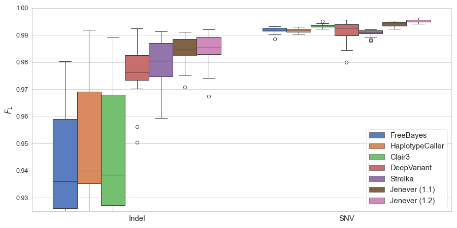
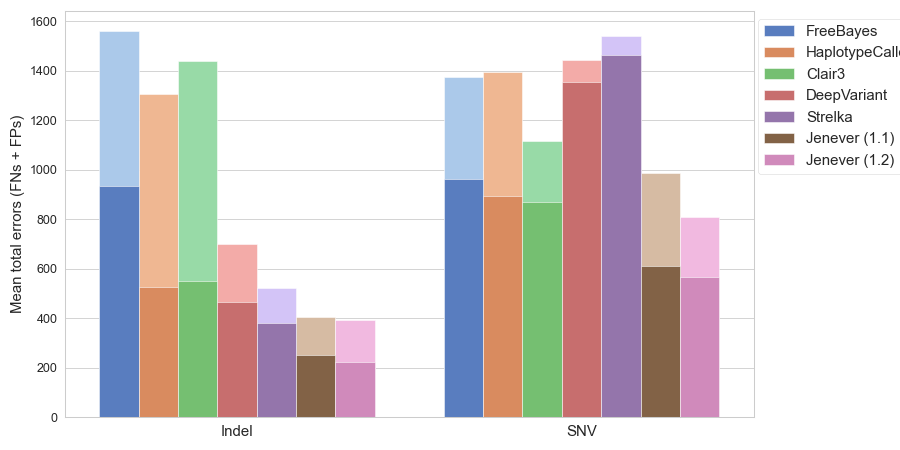

## NGS Variant detection with Generative Haplotype Prediction

This repo contains code for detecting variants from next-generation sequencing data (BAM / CRAM files)
 via generative haplotype prediction (see our [preprint](https://www.biorxiv.org/content/10.1101/2024.02.27.582327v1)).
Our model uses a deep transformer network to 'generate' haplotypes in the same manner as a modern Large Language Model (LLM), but instead of
word tokens, our model generates DNA sequence k-mers for both haplotypes. With this approach, there's not a need for
any sophisticated statistical procedures - no HMMs, no de Bruijn graphs, or decisions about mapping quality
quality cutoffs, read counts, allele frequencies, etc. The approach allows for true end-to-end deep learning
for variant detection.

## What's new with version 1.2

Jenever 1.2 contains new models with significantly improved accuracy for SNVs compared to the version 1.1 models (named 100M_s28_cont_mapsus_lolr2_epoch2 and paraclf). SNV precision has increased from 99.5% to about 99.7% (at a quality cutoff of 0.10), while SNV recall has increased modestly from 99.27% to about 99.33%. These improvements came from training on a new dataset that included ~44 WGS samples and more regions sampled from each, for a total of ~73M regions containing nearly 11B tokens.  Indel accuracy remains mostly unchanged. 

Jenever 1.1 has much improved calling performance compared to version 1.0, due to a better parallelization strategy for region encoding & calling. Variant detection accuracy should be about the same as 1.0. Also fixes a minor regression which occurred when some fixes were made to the phasing logic. The regression caused the features used in the classifier model to be incorrect in a small fraction of variants, resulting in quality scores that were too high and decreased precision (~0.1% of variants were affected). 

#### A note on Jovian

An earlier version of this tool, called Jovian, was made available in 2022 (see [preprint](https://www.biorxiv.org/content/10.1101/2022.09.12.506413v1) for details).
Jovian used a similar encoder architecture, but did not use autoregressive decoding, and had overall lower performance. 
The current version which uses autoregressive decoders to generate haplotypes is called Jenever. 

### Performance notes

A comparison of the $F_1$ statistic for Indels and SNVs across different models

The upper (pastel) portion is the mean total number of FPs per sample, and the bottom darker bar represents the mean total number of FNs. 
Jenever calls were filtered at quality 10 (phred-scaled), HaplotypeCaller at 50 , Clair3 at 0, DeepVariant at 3, and Strelka at 4, values that are close to the $F_1$-maximizing thresholds computed by $vcfeval$.
These accuracy statistics were computed by [hap.py](https://github.com/Illumina/hap.py) on held-out validation regions on chromosomes 21 and 22.

### Installation

#### Requirements

You'll need a linux / unix compatible system (MacOS is fine) with python >= 3.10 and pip installed. 

To install jenever, clone this repository, navigate to the repository directory, and enter: 

    pip install  .

on the command line. There are some pretty large dependencies (pytorch, pysam, sklearn, etc), so installation may take a few minutes.

It's a good idea to install in a separate conda environment or python virtualenv if possible, but not required unless there are dependency conflicts. 

### Model weights

Model weights are stored using [git lfs](https://git-lfs.com/), under the `models/` directory. If you don't have `git lfs` installed, the weights files will appear as small stub files with references to the actual weights objects. If you install `git lfs` after you've already cloned the repo, run

    git lfs fetch

followed by

    git lfs checkout

to actually download the weights.

There are two types of model files. The first stores weights for the main transformer model used for haplotype generation. These are big, often over 1GB. The second is the 'classifier' model which predicts variant quality from multiple overlapping haplotypes. The classifier model files are typically much smaller (~40MB)

#### Model files:
- **good44fix_epoch280.model**: New in v1.2, this contains weights for an improved transformer model with better precision and sensitivity for SNVs
- **g44e280_clf.model**: New in v1.2, this is a new classifier model trained with calls form the "good44fix" transformer.
- **100M_s28_cont_mapsus_lolr2_epoch2.model**: The v1.0  weights for the main transformer model, as used in the Jenever publication. It has been trained on short-read WGS data aligned with the [GEM-mapper](https://github.com/smarco/gem3-mapper) aligner. Performance on BWA-aligned data is a bit lower.
- **s28ce40_bamfix.model**: The v1.0 classifier model, as used in the Jenever publication
- **paraclf.model**: New in v1.1, this classifier model was trained on more data with slightly higher performance the the previous model. 

### Calling variants

Calling variants requires an alignment file in bam / cram format, a model file, a list of regions to examine in BED format, and a fasta reference sequence. A basical calling command looks like: 

    jenever call -r <reference genome fasta> 
      --threads <number of threads to use> 
      -m /path/to/model
      --bed /path/to/BED file 
      --bam /BAM or CRAM file
      -c /path/to/classifier.model
      -v output.vcf

The above command will call germline variants in the regions defined by the BED file and write them as a standard VCF file.
Runtimes are long and a GPU is required for tolerable performance when more than a few small regions are being called. 
In general performance is somewhere near 15MB (megabases) per hour, depending on how many regions trigger the
generation procedure, the number of threads and batch size, and the GPU speed. 

### Warning!
The current Jenever model has been trained on Illumina WGS germline short-read data, and is not likely to work on hybrid-capture (e.g. exome), long read, somatic, or other types of genomic data. 

### Training a new model

#### Creating training from labelled BAMs (pregen)

Training requires converting pileups (regions of BAM files) into tensors. Because that process is very slow 
it makes sense to just do it once and save the tensors to disk so they can be used in multiple 
training runs. This is called `pregen` (for pre-generation of training data). The pregenerated training 
tensors and 'labels' (true alt sequences, stored a k-mer indices) are stored in a single directory. To create pregenerated training 
data, run

    ./main.py pregen --threads <thread count> 
      -c <conf.yaml> 
      -d /path/to/output/directory

Depending on how may BAMs and how many labeled instances there are, this can take a really long time.

The configuration file `conf.yaml` must have a path to the reference genome, the number of examples to 
choose from each region type, and a list of BAMs + labels, like this:

    reference: /path/to/reference/fasta

    vals_per_class:
        'snv': 5000   # keys here should match labels in fourth column of BED files provided below    
        'deletion': 500
        'insertion': 500
        'mnv': 1000

    data:
      - bam: /path/to/a/bam
        vcf: /path/to/truth/variants.vcf
        bed: /path/to/regions/to/sample.bed

      - bam: /path/to/another/bam
        vcf: /path/to/another/vcf
        bed: /path/to/another/regions/bed
      .... more bams/ labels ...

The BED files must be four-column BED files where the fourth column is the region label. 
The label scheme is completely flexible and up to the user, but in general should match the values 
in 'vals_per_class' from the configuration file. 

### Performing a training run

To train a new model, run a command similar to

    dnaseq2seq/main.py train -c training_conf.yaml --run-name my_new_run

It's possible to continue training from a checkpoint by providing an input model with the

     --input-model <path to checkpoint model> 

### Training a 'classifier'

In order to generate well-calibrated quality scores, it's necessary to train a small classifier that learns to predict true and false positive variants. To do this, you must create a configuration file that links VCFs with examples of true and false positive variants to BAM files. The configuration file specifies one or more samples, each of which has a BAM/CRAM file and one or more sets of true positive and false positive variants. Like this:

    sample1:
      bam: /path/to/sample1.cram
      fps:
      - false_positive_calls.vcf
      - some_falsepositives.vcf
      tps:
      - true_positives.vcf
    
    sample2:
      bam: /path/to/sample2.bam
      fps:
      - sample2_falsepositives.vcf
      tps:
      - sample2_truepositives.vcf

To generate the classifier, run the `dnaseq2seq/builddclf.py` tool with the `train` argument and the path to the configuration file as an option. 
